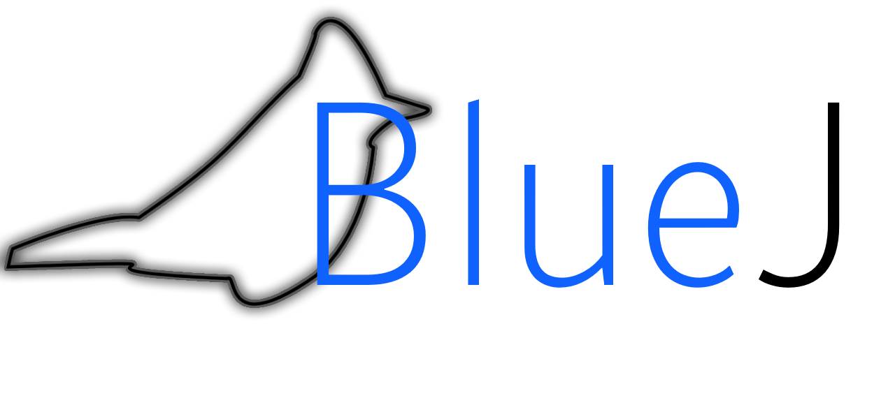
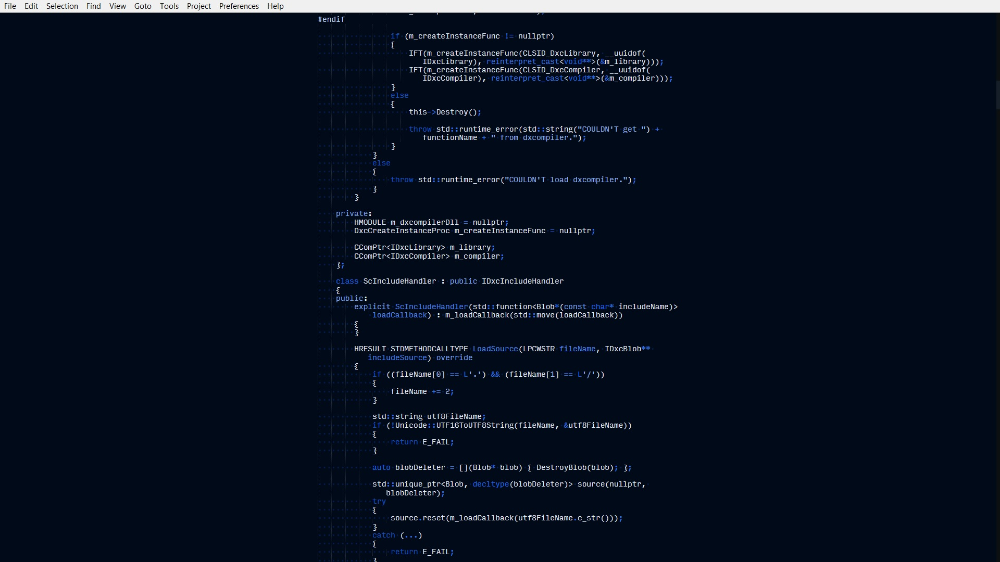

# BlueJ

A monochromatic dark theme for Sublime Text 3.
# About
BlueJ is a syntax theme for Sublime Text 3. I created it because I wanted to have a theme for ST3 that was based on one unified color, and I chose my favorite, blue. It is based off of [IBM's main design language color](https://www.ibm.com/design/language/color).
# Installation
To install BlueJ, first install [Package Control](https://packagecontrol.io/installation). Next, under **Preferences**, click **Browse Packages**, and a folder will open labelled *Packages*. Create a new folder (a good name would be "BlueJ"), and drop the .tmTheme in there. Return to Sublime Text 3, and under **Preferences** click **Color Scheme**, and choose the theme that has the same name as your folder.
# To Do
Blue J is a very early syntax, and it is my first time working with XML. As time goes on, I hope to unify the design language of the syntax and make more logical creative choices than what is currently present. If you have any suggestions, please let me know. However, here's what I'm currently looking at working on:
- Changing the palette / coloring of various keywords, scopes, etc, in order to disperse the gradient of tints and shades.
- Creating versions for Notepad++ and potentially Visual Studio Code and CLion. If you would like your text editor included in this list, please let me know.
# Credits
- A huge thank you to edelstone for their [tint and shade generator](https://maketintsandshades.com/), which acted as great resource during creation.
- [tmTheme Editor](http://tmtheme-editor.herokuapp.com/#!/editor/theme/Monokai), by aziz was an incredibly useful learning and prototype tool for the early stages of this syntax theme, and taught me a great deal about how the XML works for tmTheme.
- Finally, a thank you to [IBM's design language](https://www.ibm.com/design/language/) for providing a useful resource for making great looking products.
- BlueJ Logo was created by Charles Alaras.
